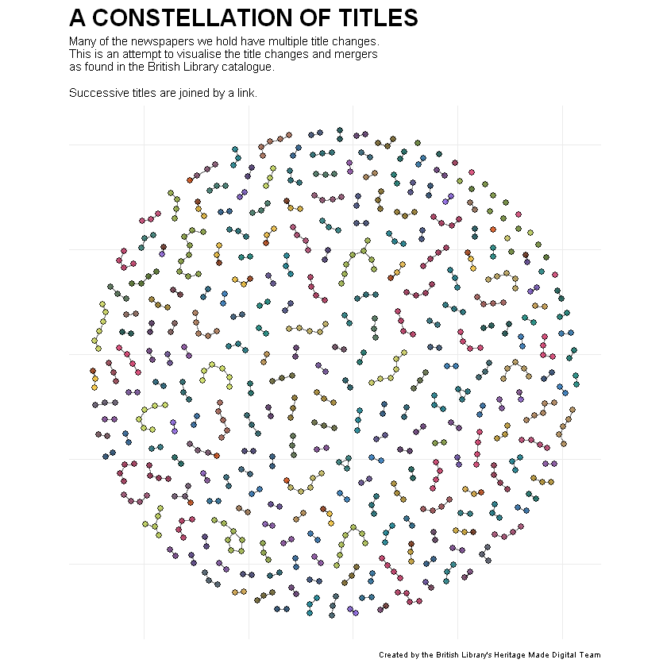

# Visualising grouped titles using network visualisations

Lots of the Library's newspaper titles split, merged or changed names. This is recorded in the 'succeeding title' field. Using network plotting software we can visualise the title changes pretty nice. 

Load libraries:


```R
library(tidygraph)
library(igraph)
library(ggraph)
library(tidyverse)
```

Make some colors:


```R
libraryPalettePaired = c("#3D5C12",
                         "#CEE055",
                         "#831C3D", 
                         "#DA2F65",
                         "#0D5257",
                         "#00788B", 
                         "#665012",
                         "#FFC82E", 
                         "#3F1F4C", 
                         "#7E3E98",
                         "#0F375C", 
                         "#1E6EB8", 
                         "#003A34", 
                         "#018074",
                         "#36245C",
                         "#865BE7", 
                         "#551A01",
                         "#D44202")
```


```R
more_colors = colorRampPalette(libraryPalettePaired)
all_the_cols = more_colors(288)
```

Load the title list from [the British Library Research Repository](https://doi.org/10.23636/1136):


```R
working_list = read_csv('BritishAndIrishNewspapersTitleList_20191118.csv')
```

    Parsed with column specification:
    cols(
      .default = col_character(),
      title_id = col_double(),
      nid = col_double(),
      nlp = col_double(),
      first_date_held = col_double(),
      publication_date_one = col_double(),
      publication_date_two = col_double()
    )
    See spec(...) for full column specifications.
    

Filter out NA values and duplicates:


```R
cleaned_list = working_list %>% 
filter(!is.na(publication_title)) %>% 
  filter(!is.na(succeeding_titles)) %>%
distinct(nid, .keep_all = TRUE) %>% 
distinct(publication_title, .keep_all = TRUE)
```

Remove punctuation:


```R
cleaned_list$succeeding_titles = gsub(". no.*", "", cleaned_list$succeeding_titles)
cleaned_list$succeeding_titles = gsub(". [0-9].*", "", cleaned_list$succeeding_titles)
cleaned_list$succeeding_titles = gsub("Continued by: ", "", cleaned_list$succeeding_titles)
cleaned_list$succeeding_titles = gsub("Continued in part by: ", "", cleaned_list$succeeding_titles)
```

Multiple title changes are separated by a '|' in the data. We want to separate these into different columns. Then make a dataframe containing just the NID (a unique ID) for each pair of titles/succeeding titles.


```R
sep_list = cleaned_list %>% separate(succeeding_titles, sep = "[|]", into = c('a', 'b', 'c', 'd'))

a = sep_list %>% select(nid, publication_title, a)
b = sep_list %>% select(nid, publication_title, b)
c = sep_list %>% select(nid, publication_title, c)
d = sep_list %>% select(nid, publication_title, d)

colnames(a)[3] = 'succeeding_titles'
colnames(b)[3] = 'succeeding_titles'
colnames(c)[3] = 'succeeding_titles'
colnames(d)[3] = 'succeeding_titles'

just_nid = cleaned_list %>% select(publication_title, nid)
colnames(just_nid) = c('succeeding_titles', 's_nid')

abcd = rbind(a,b,c,d)
abcd = abcd %>% left_join(just_nid)
```

    Warning message:
    "Expected 4 pieces. Additional pieces discarded in 2 rows [6311, 8357]."Warning message:
    "Expected 4 pieces. Missing pieces filled with `NA` in 8801 rows [1, 2, 3, 4, 5, 6, 7, 8, 9, 10, 11, 12, 13, 14, 15, 16, 17, 18, 19, 20, ...]."Joining, by = "succeeding_titles"
    


```R
titles_df = abcd %>% select(nid, s_nid)
titles_df = titles_df %>% filter(!is.na(s_nid))
```


```R
head(titles_df,5)
```


<table>
<thead><tr><th scope=col>nid</th><th scope=col>s_nid</th></tr></thead>
<tbody>
	<tr><td> 6066</td><td> 6067</td></tr>
	<tr><td>11049</td><td> 6067</td></tr>
	<tr><td> 4259</td><td> 4256</td></tr>
	<tr><td>23911</td><td>23912</td></tr>
	<tr><td> 3525</td><td> 3532</td></tr>
</tbody>
</table>


Change the columns to 'source' and 'target', give them a label, separate into two separate dataframe, rename these, join together all the unique values to make the node list


```R
colnames(titles_df) = c('source', 'target')
sources = titles_df %>% distinct(source)
dest = titles_df %>% distinct(target)
colnames(sources) =  'label'
colnames(dest) =  'label'
nodes = full_join(sources, dest, by = 'label')
nodes <- nodes %>% rowid_to_column("id")
```

Make the edge list:


```R
edges <- titles_df %>%
  left_join(nodes, by = c("target" = "label")) %>%
  rename(to = id)
edges <- edges %>%
  left_join(nodes, by = c("source" = "label")) %>%
  rename(from = id)
edges <- select(edges, from, to)
```

Make an igraph object:


```R
newspaper_igraph <- graph_from_data_frame(d = edges, vertices = nodes, directed = FALSE)
```

Make a tidygraph object:


```R
newspaper_igraph_tidy <- as_tbl_graph(newspaper_igraph)
```

Plot the 'network'


```R
newspaper_igraph_tidy %>% 
  activate(nodes) %>%
         mutate(degree = centrality_degree()) %>% 
         mutate(community = as.factor(group_infomap())) %>% 
           left_join(cleaned_list, by = c("label" = "nid")) %>% 
         filter(coverage_city == 'London') %>% ggraph(layout = 'fr')   + 
  geom_edge_link(alpha = .5) + 
  geom_node_point(pch = 21,  
                  color = 'black',
                  alpha = .8, 
                  size = 2, 
                  stroke = .2, aes(fill = community)) +
theme_minimal() + 
theme(panel.grid.major = element_blank()) +
theme(axis.ticks = element_blank()) +
theme(axis.text = element_blank()) + 
  theme(axis.title = element_blank()) +
  labs(title = 'A CONSTELLATION OF TITLES', 
       subtitle = 'Many of the newspapers we hold have multiple title changes.\nThis is an attempt to visualise the title changes and mergers\nas found in the British Library catalogue.\n\nSuccessive titles are joined by a link.',
       caption = "Created by the British Library's Heritage Made Digital Team") + 
  theme(plot.title = element_text(size = 18, face = 'bold'), 
        plot.subtitle = element_text(size = 9), 
        plot.caption = element_text(size = 6)) + 
  scale_fill_manual(values = all_the_cols) + 
  theme(legend.position = 'none') + coord_fixed()
```





```R

```
